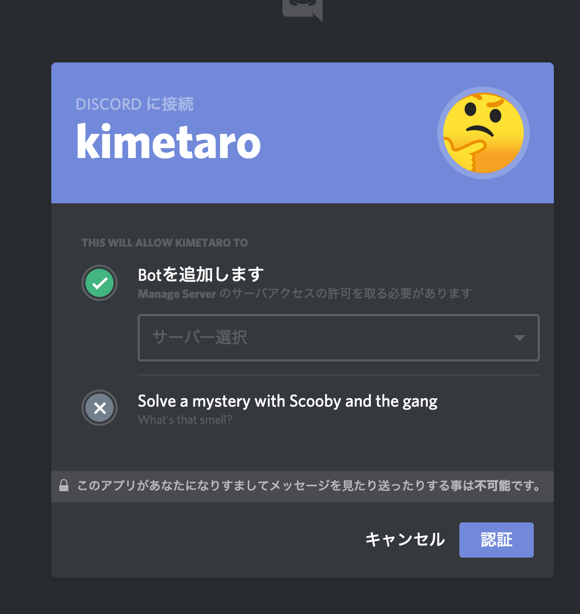

# kimetaro

Kimetaro is the BOT which selects one of lists(Discord/Slack)

## How to introduce

1. Access the authorization page.(https://discordapp.com/api/oauth2/authorize?client_id=569752486483591168&permissions=0&scope=bot)
2. Select the server which you would like to register.
   
3. Done

## How to operate

#### Call

```bash
!hey
決め太郎「おーきに」
```

#### Register(Not implemented)

```bash
!add planA
!add planB
```

#### List(Not implemented)

```bash
!list
 1. planA
 2. planB
```

#### Kimetaro(Not implemented)

```bash
!choice
 ～面白い演出
 決め太郎「決めたで！ planBや」
```

#### Bye(Not implemented)

```bash
!bye
決め太郎「ほな」
```
